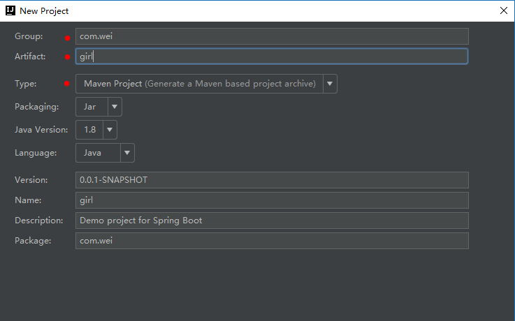
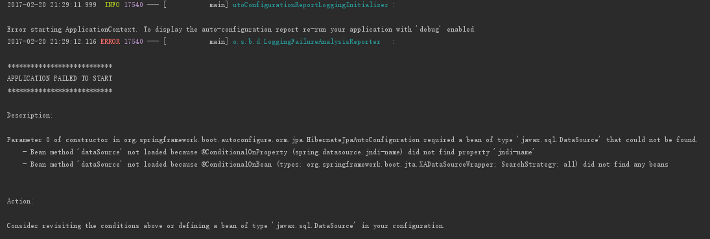

#SpringBoot-basic
##1. SpringBoot特点
- 化简为繁，简化配置；
- 是下一代框架；
- 微服务的入门级微框架；
> SpringBoot-->SpringCloud-->微服务，SpringBoot是微服务的基础。
##2. IDEA创建SpringBoot应用
1. create new project-->Spring Initializr；
2. Initializr Service URL填写：http://start.spring.io；
3. 输入项目相关信息；

4. 依赖项选择web-->web；
##3. 依赖项：pom.xml
``` xml
<dependencies>
		<!-- SpringBoot web应用必须的依赖 -->
		<dependency>
			<groupId>org.springframework.boot</groupId>
			<artifactId>spring-boot-starter-web</artifactId>
		</dependency>

		<!-- 单元测试的依赖 -->
		<dependency>
			<groupId>org.springframework.boot</groupId>
			<artifactId>spring-boot-starter-test</artifactId>
			<scope>test</scope>
		</dependency>
	</dependencies>

	<build>
		<plugins>
			<!-- 使用maven构建SpringBoot的插件 -->
			<plugin>
				<groupId>org.springframework.boot</groupId>
				<artifactId>spring-boot-maven-plugin</artifactId>
			</plugin>
		</plugins>
	</build>
```
##4. SpringBoot配置
> 项目创建的是application.properties文件，建议使用application.yml。

1. yml语法
```
name: value
```
> 说明：冒号`:`后面必须有一个空格

2. 获取配置文件中参数的值

> 可以用注解@value("${name}")来获取配置文件中参数的值。

application.yml
```
age: 18
```

application.yml
```
        <!-- 注解依赖 -->
        <dependency>
            <groupId>org.springframework.boot</groupId>
            <artifactId>spring-boot-configuration-processor</artifactId>
            <optional>true</optional>
        </dependency>
```

HelloController.java
``` java
    @Value("${age}")
    private Integer age;
```

3. 在配置中再使用配置
```
cupSize: B
age: 18
content: "cupSize: ${cupSize}, age: ${age}"
```

4. 多个配置构成一个分组

application.yml
```
girl:
  cupSize: B
  age: 18
```
Grilproperties.java：编写Bean
``` java
@Component
@ConfigurationProperties(prefix = "girl")
public class Grilproperties {
    private String cupSize;
    private Integer age;

    public String getCupSize() {
        return cupSize;
    }
    public void setCupSize(String cupSize) {
        this.cupSize = cupSize;
    }
    public Integer getAge() {
        return age;
    }
    public void setAge(Integer age) {
        this.age = age;
    }
}
```
> 说明：Grilproperties类需要两个注解@Component 和 @ConfigurationProperties(prefix = "girl")
> - @Component 注解用来声明该类为Bean类；
> - @ConfigurationProperties(prefix = "girl")用来获取配置文件中的值，其中参数`prefix `的值为分组的名字；

HelloController.java
``` java
@RestController
public class HelloController {

    @Autowired
    private Grilproperties grilproperties;

    @RequestMapping(value = "/hello", method = RequestMethod.GET)
    public String say(){
        return grilproperties.getCupSize();
    }
}
```

5. 多环境配置
创建多个配置文件
- application.yml：主配置文件；
-  application-dev.yml：开发环境；
-  application-prod.yml：生产环境。

主配置文件中：
``` 
spring:
  profiles:
    active: dev
```
> active的值可以根据需要设置为dev或者prod。

##5. Controller的使用
|注解                   | 作用                 |  
|:---------------------|:---------------------|
|@Controller          |  处理http请求     |
|@RestController      |  Spring4之后新加注解，原来返回json需要@ResponseBody配合@Controller|
|@RequestMapping      | 配置URL映射        |
|@PathVariable        | 获取URL中的数据     |
|@RequestParam        | 获取请求参数的值    |
|@GetMapping          | 组合注解           |
###1. @RequestMapping注解
1. @RequestMapping(value = {"/hello", "/hi"}, method = RequestMethod.GET)的value值可以设置多个，写为集合`value = {"/hello", "/hi"}`；
2. @RequestMapping可以注解到方法上，也可以作用到类上；
3. 可以用@GetMapping(value="/hello")、@PostMapping(value="/hello")简化@RequestMapping的写法。
###2. 获取参数值
1. 对于`/hello/100`这样的URL
``` java
	@RequestMapping(value = "/hello/{id}", method = RequestMethod.GET)
    public String say(@PathVariable("id") Integer id){
        return "id: " + id;
    }
```
2. 对于`/hello?id=100`这样的URL
``` java
    @RequestMapping(value = "/hello", method = RequestMethod.GET)
    public String say(@RequestParam("id") Integer id){
        return "id: " + id;
    }
```
3. 为参数设置默认值
``` java
    @RequestMapping(value = "/hello", method = RequestMethod.GET)
    public String say(@RequestParam(value="id", required = false, defaultValue = "0") Integer id){
        return "id: " + id;
    }
```
> 其中`required `：是否必传；`defaultValue`：为默认值，参数值必须为字符；

##6. 数据库操作
Spring-Data-Jpa ---> MySQL
###1. 配置数据库依赖项：pom.xml
``` xml
		<!-- 数据库组件 -->
		<dependency>
			<groupId>org.springframework.boot</groupId>
			<artifactId>spring-boot-starter-data-jpa</artifactId>
		</dependency>

		<dependency>
			<groupId>mysql</groupId>
			<artifactId>mysql-connector-java</artifactId>
		</dependency>
```

###2. 配置连接数据库的参数：application.yml
```
spring:
  datasource:
    driver-class-name: com.mysql.jdbc.Driver
    url: jdbc:mysql://127.0.0.1:3306/dbgirl?characterEncoding=utf8&useSSL=true 
    username: root
    password: root
  jpa:
    hibernate:
      ddl-auto: create
    show-sql: true
```
> 注：本例中Spring Boot的版本为1.5.1，应用上述配置会报以下错误 
``` 
Exception encountered during context initialization - cancelling refresh attempt: org.springframework.beans.factory.UnsatisfiedDependencyException: Error creating bean with name 'org.springframework.boot.autoconfigure.orm.jpa.HibernateJpaAutoConfiguration': Unsatisfied dependency expressed through constructor parameter 0; nested exception is org.springframework.beans.factory.NoSuchBeanDefinitionException: No qualifying bean of type 'javax.sql.DataSource' available: expected at least 1 bean which qualifies as autowire candidate. Dependency annotations: {}
```

> 必须使用多环境配置，即：
```
spring:
  profiles:
    active: dev
  datasource:
  ... ...
```
###3. 创建数据库表对应的类
``` java
@Entity
public class Gril {
    @Id
    @GeneratedValue
    private Integer id;

    private String cupSize;

    private Integer age;

    public Gril() {
    }

	// set、get方法...
}
```
> 说明
> 1. @Entity注解：注明该类是实体类；
> 2. 必须创建无参构造器；
> 3. @Id注解：标明主键；
> 4. @GeneratedValue注解：标明主键自增。

###4. Spring-data-jpa操作数据库
GirlRepository.java
创建接口GirlRepository，继承JpaRepository
``` java
public interface GirlRepository extends JpaRepository<Girl, Integer> {
}
```
> JpaRepository后的泛型，第一个是实体类，第二个是实体类主键的类型。

GirlController.java
``` java
@RestController
public class GirlController {
    @Autowired
    private GirlRepository girlRepository;

    /**
     * 查询所有女生列表
     * @return
     */
    @GetMapping(value = "/girls")
    public List<Girl> girlList(){
        return girlRepository.findAll();
    }
    
    /**
     * 添加一个女生
     * @param cupSize
     * @param age
     * @return
     */
    @PostMapping(value = "/girls")
    public Girl girlAdd(@RequestParam("cupSize") String cupSize, @RequestParam("age") Integer age){
        Girl girl = new Girl();
        girl.setCupSize(cupSize);
        girl.setAge(age);

        return girlRepository.save(girl);
    }

    /**
     * 查询一个女生
     * @param id
     * @return
     */
    @GetMapping(value = "/girls/{id}")
    public Girl girlFindOne(@PathVariable("id") Integer id){
        return girlRepository.findOne(id);
    }

    /**
     * 更新
     * @param id
     * @param cupSize
     * @param age
     * @return
     */
    @PutMapping(value = "/girls/{id}")
    public Girl girlUpdate(@PathVariable("id") Integer id, @RequestParam("cupSize") String cupSize, @RequestParam("age") Integer age){
        Girl girl = new Girl();
        girl.setId(id);
        girl.setCupSize(cupSize);
        girl.setAge(age);

        return girlRepository.save(girl);
    }

    /**
     * 删除一个女生
     * @param id
     */
    @DeleteMapping(value = "/girls/{id}")
    public void girlDelete(@PathVariable("id") Integer id){
        Girl girl = girlFindOne(id);
        girlRepository.delete(girl);
    }
}
```
> 用GirlRepository：
> - findAll();查询所有数据；
> - findOne(arg);按条件查询一条数据；
> - save(arg);用于保存和更新数据；
> - delete(arg);用于删除一个数据。

####查询扩展
接口GirlRepository.java中：
``` java
public interface GirlRepository extends JpaRepository<Girl, Integer> {

    // 通过年龄来查询
    public List<Girl> findByAge(Integer age);
}
```
> 注：方法名要根据查询字段来确定，不能乱写；

GirlController.java
``` java
    /**
     * 通过年龄查询
     */
    @GetMapping(value = "/girls/age/{age}")
    public List<Girl> girlListByAge(@PathVariable("age") Integer age){
        return girlRepository.findByAge(age);
    }
```

##7. 事务管理
GirlService.java
``` java
@Service
public class GirlService {

    @Autowired
    private GirlRepository girlRepository;

    @Transactional
    public void insertTow() {
        Girl girlA = new Girl();
        girlA.setCupSize("A");
        girlA.setAge(18);
        girlRepository.save(girlA);

        Girl girlB = new Girl();
        girlB.setCupSize("B");
        girlB.setAge(20);
        girlRepository.save(girlB);
    }
}
```
> 在Service上或Service的方法上添加@Transactional注解
GirlController.java
``` java
    @Autowired
    private GirlService girlService;

    /**
     * 事务管理
     */
    @PostMapping(value = "/girls/two")
    public void girlTow(){
        girlService.insertTow();
    }
```
